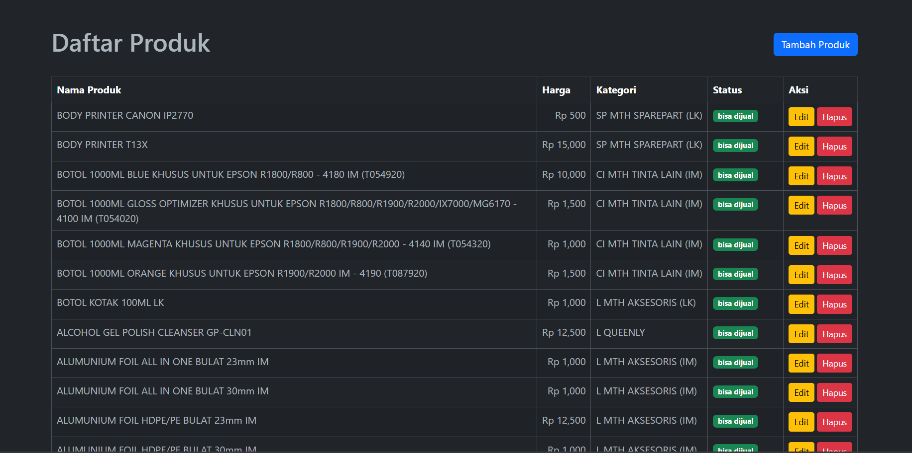
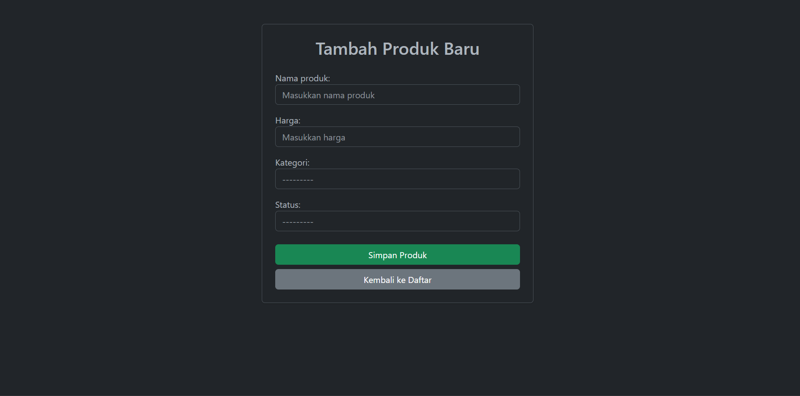
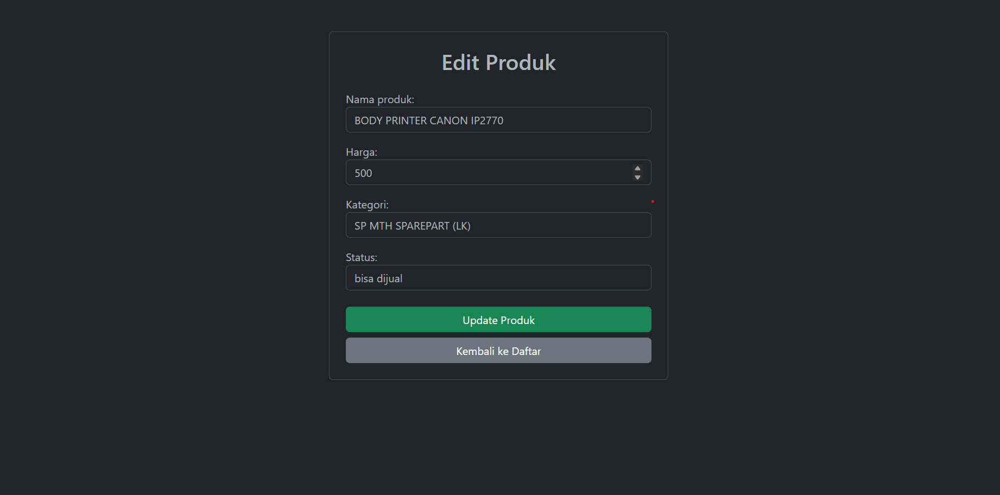

# FastPrint - Aplikasi Manajemen Produk

Aplikasi manajemen data produk menggunakan framework Django. Proyek ini dibuat sebagai bagian dari seleksi tahap pertama posisi Programmer di Fast Print.

## Teknologi

- Python 3.x
- Django 5.2
- MySQL 8.0
- Docker & Docker Compose

## Fitur
- Menampilkan daftar produk 
- Tambah, edit, hapus produk

## Screenshot

### Halaman Utama


### Tambah Produk


### Edit Produk


## Instalasi

### Menggunakan Docker 

1. Clone repository
```bash
git clone https://github.com/Alfa4258/fastprint-test.git
cd fastprint-test
```

2. Jalankan Docker Compose
```bash
docker-compose up --build
```

3. Jalankan migrasi database (terminal baru)
```bash
docker-compose exec web python src/manage.py migrate
```

4. Import data produk dari API
```bash
docker-compose exec web python src/manage.py import_produk
```

5. Akses aplikasi di `http://localhost:8000`

### Tanpa Docker

1. Clone repository dan buat virtual environment
```bash
git clone https://github.com/Alfa4258/fastprint-test.git
cd fastprint-test
python -m venv venv
source venv/bin/activate  # Linux/Mac
venv\Scripts\activate     # Windows
```

2. Install dependencies
```bash
pip install -r requirements.txt
```

3. Copy dan konfigurasi environment
```bash
cp .env.example .env
# Edit .env sesuai konfigurasi database lokal
```

4. Jalankan migrasi database
```bash
cd src
python manage.py migrate
```

5. Import data produk dari API
```bash
python manage.py import_produk
```

6. Jalankan server
```bash
python manage.py runserver
```


